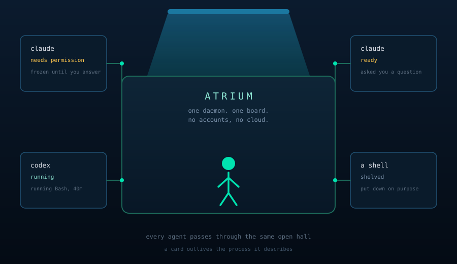

# Atrium

_The single open hall every agent passes through._

<p align="center">
  
</p>

## Why it is called that

A Roman house was built around one open room. Every other room had a door onto it, the roof was open above it so
it was the only part of the house with its own light, and anyone crossing from one room to another crossed it.
You stood in the atrium and saw the whole household at once.

That is the shape of the problem. Half a dozen coding agents are running, each in its own directory, each with
its own conversation, none of them aware of the others. Without somewhere to stand you are alt-tabbing between
terminals asking the same four questions over and over: which one needs me, how long has it been sitting there,
what was I even doing in that one, and is it still alive.

Atrium is the room you stand in. The agents keep their own rooms. Nothing moves between them except through
here.

Three things follow from taking the metaphor seriously, and they are the design:

- **You are in the hall, not in a room.** The board is not a terminal multiplexer. It answers what needs you,
  and gets out of the way when nothing does.
- **A room outlives whoever is in it.** A card is not an agent. It is a place work happens, and it survives the
  process, the restart and the conversation. `wire_name` is an attribute of a card; a pid is a reconnect hint.
- **Rooms do not connect to each other.** One session reaching another goes through the hall and is queued, not
  typed. Atrium owns a terminal a person may be mid-command in, and a peer is not that person.

It runs on one machine, for one person. No multi-tenancy, no accounts, no cloud.

```powershell
go build -o build.claude\ .\...
.\build.claude\atrium.exe install     # copy it somewhere it can stay
& "$env:USERPROFILE\.atrium\bin\atrium.exe" daemon
# agents -> http://localhost:7777
# board  -> http://localhost:7778
```

Running the daemon from the installed copy rather than from `build.claude\` matters more than it looks. Hooks
name a path, the logon task names a path, and the self-restart swaps a binary at a fixed name. A path under
`build.claude\` moves with the checkout and is rewritten by every build, so anything pointing at it goes stale
the next time you rebuild.

## What it gives you

**A board.** Every agent is a card in a kanban column: needs permission, ready, running, finished, shelved. The
columns are buckets of your attention, so a card sits in one because you have to act or because you decided
something. A column folds away when it gets tall, an empty one gives its width back to the ones you are reading,
and a column that cannot fill hides itself entirely.

**The difference between a question and a finish.** `ready` covers two things that want very different amounts
of hurry: an agent that ran out of work and will sit there forever costing nothing, and an agent that asked you
something and cannot continue. Atrium tells them apart, because Claude Code's `Notification` hook fires only for
the second and asking is itself a tool call. A card that asked says so, and sorts above one that merely stopped.

**What each one is doing right now.** A live badge per card: thinking, running `Bash`, three subagents, and how
long it has been at it. This is the difference between "leave it alone" and "go look at it", and "running Bash
for 40 minutes" is not something a status column can tell you. Never stored, because a stored activity is a lie
the moment the daemon restarts.

**A permission gate.** A PreToolUse hook sends every tool call an agent wants to make to atrium, which blocks
until you answer. Approving is one click. Blocking hands your reason back to the agent, so a refusal is "no, do
this instead" rather than a wall. Every request says which agent is asking, because with several running the
same command means different things from different sessions.

**Standing rules, so you stop clicking.** Answer once with **always** or **never** and every matching request
after that is answered instantly and never shown. A rule covers either a command shape or a folder:

- A **command shape** is a prefix by default, or a glob when it contains `*` or `?`. `go build` covers every
  later build and leaves `go install` to ask on its own.
- A **folder** covers work inside a directory. Two ways in: the command names an absolute path inside it, or
  the session is working inside it and the command does not reach out. The second is what makes it useful,
  since commands are written relative to where the session is and `go test ./...` names no path at all. A
  command mentioning any absolute path outside the folder, or climbing out with `..`, still asks. It does not
  follow a `cd`: a rule answers a request, it does not simulate a shell.

  Folders exist because writing the same thing as a glob means accounting for the quoting yourself, and
  `rm -f "C:/x/*"` fails against `rm -f "C:/x/y.db"` over the closing quote alone. Silently.

The most specific match wins, so a narrow rule overrides a broad one. Atrium can import the allow and deny lists
Claude Code already has, which on a working setup means starting with a hundred or more rules rather than none.

**Auto mode, when you do not want to be asked at all.** Turn it on for one session, or for the whole board, and
requests are approved without stopping while everything is still recorded. It does not override a **never** rule
or a shelved card: auto mode means stop asking me new questions, not forget the answers I already gave.
Afterwards, **what did it do?** reads the record back, grouped by tool, with identical calls folded into one line
and the decisions nobody saw put first. That last part is the whole trade: interruption for review.

**The change, not just the target.** A pending edit shows a real diff, with unchanged context dimmed and the
changed words picked out. "Approve this edit" is not a question you can answer from a file path.

**Notifications that reach you.** A desktop notification has approve and block buttons and works with no atrium
tab open. It carries the card's own mark, so which agent it came from is a picture rather than a sentence. An
in-page toast covers the case where the tab is already in front. Sounds are per card, because knowing which
session wants you without looking is the thing you cannot get any other way.

**Terminals atrium owns.** claude, codex, ollama, a bare shell, or anything else you add. A runner is a command,
arguments, a working directory, an environment, and a way to resume. Adding one is configuration, not a code
change. Anything atrium launches runs under a pseudo terminal it owns, so you can attach in the browser, type
into it, and stop it.

**A terminal in its own window.** Alt-tab beats a click into an app and then a click onto a tab, and nothing
could beat it while a session was a pane inside a page. A popped-out window is the same page in terminal-only
mode, titled with the session's whole address, marked in the title bar when that session wants you, and closing
itself when its runner exits.

**Files, in both directions.** Drop or paste into a session to send a file in. Browse the session's directory to
get one back out, a file at a time or the whole tree as a zip. Everything resolves through one containment check
against that card's own directory, and anything outside answers `403` whether or not it exists. It works over an
overlay for free, because it is the board's own HTTP.

**Something to say to a running session.** Queue a message and it is delivered the next time that session can
hear one: typed into its terminal when atrium owns it, carried back through a hook when it does not. It arrives
framed as a message from you rather than as a policy refusal. Named prompts you write once are offered on every
card, including one that tells a session to write up what it did and finish.

**An inbox.** A command on a timer finds work and posts it, and atrium raises a card with no runner behind it. A
source that fails is reported on its own row and switched off after three consecutive failures with the reason
attached. Atrium never learns what a source means: `github`, `zendesk` and `ci` are words on a badge.

**A history.** Every card has an append-only event log, and every permission decision records which agent asked
and who answered: you, the rule that matched, or auto mode. Every card ever created stays searchable whether or
not it is still on the board. Filterable, exportable as JSON or CSV.

**Liveness for free.** A card stores its runner's process id, and whether that process still exists is a question
the operating system answers. No turn, no token, no contact with the agent.

**Reachable from elsewhere, without becoming a proxy.** Atrium can serve the board on a zrok share or an
OpenZiti service. Both SDKs hand back a `net.Listener` and the board is one `http.Handler`, so atrium answers on
the overlay itself: no child process to supervise, no output to scrape, and nothing proxied anywhere. It never
holds an identity or decides who may connect. Loopback and no login stays true.

**Or lend one session to one person.** Publishing the board hands over every card. `share this session` on a
card serves a restricted handler on its own address that answers for that terminal and 403s everything else,
with an allowlist rather than a filter, so an endpoint added later is invisible to a guest until somebody adds
it deliberately. Read-only is enforced on the socket, because a guest owns their copy of the page.

**A way to stop that is not a kill.** `atrium stop` winds the daemon down the way ctrl-c does: event streams
released, supervised runners given ten seconds, listeners closed in order. Killing the process closes every
pseudo terminal at once and takes the runners with it.

## Quick start

### 1. Build

```powershell
go build -o build.claude\ .\...
```

### 2. Run the daemon

```powershell
.\build.claude\atrium.exe daemon
```

Two listeners, on purpose. Agents talk to `:7777`. You talk to `:7778`. If storage ever fails, the agent listener
closes and stays closed, so runners park on connection-refused and burn nothing, while the board stays up to say
what broke. Running without durable state is worse than not running.

Open <http://localhost:7778>.

### 3. Gate a session through it

Atrium sees an agent when that agent's hook reports in. From the board, **runners** then **hooks** writes the
missing ones into your Claude Code settings. The hooks post to `/permission` before every gated tool call and to
`/session` when a session starts or ends.

A minimal hook posts JSON like this and blocks on the response:

```json
{ "agent": "my-session", "tool": "Bash", "command": "go build ./...", "pid": 4242, "cwd": "/path/to/repo" }
```

```json
{ "decision": "approve", "reason": "", "command": "optional rewrite" }
```

A hook must never fail a session. Everything a hook posts is best effort, and the permission hook fails open when
atrium is unreachable. See `docs/user-guide.md` for a working PowerShell hook, and "Permissions-only mode" for
gating every session on a machine without wiring anything into the agent itself.

### 4. Import the rules you already trust

On the board, **perms** then **import rules from claude**. It previews what it would add before adding anything,
translating `Bash(go build:*)` into a prefix and `//c/temp/**` into a real path, and reporting anything it cannot
map rather than dropping it silently.

## Two other modes

**Hub and agent loop.** The original mode, still here and untouched. `atrium hub` is a terminal you type into,
and a claude session with the `atrium-agent` MCP server wired in calls one tool, `submit`, in a loop: it posts,
blocks until you reply, acts on the reply, posts again. The agent absorbs disconnects and long-poll timeouts
silently, so the model never wakes up while you are away and idle costs nothing.

**State aggregator.** `atrium serve`, `status` and `watch` read a session ledger written by an external worktree
tool and expose it over MCP. Optional, and inert unless `WORKTREE_ROOT` points at a ledger it understands.

## Configuration

| Var | Default | Meaning |
| --- | --- | --- |
| `WORKTREE_ROOT` | unset | Root of a worktree tree. The daemon keeps its database in `hub/` under it. Unset means `~/.atrium`. |
| `ATRIUM_HUB_URL` | `http://localhost:7777` | Where the hooks post. |
| `ATRIUM_PERM_GATE` | unset | `on` gates every session. `off` disables. Unset gates only sessions with the atrium-agent MCP wired in. |
| `ATRIUM_AGENT_NAME` | directory name | What a session calls itself. Set automatically for runners atrium launches. |
| `ATRIUM_TASK_ID` | unset | Binds a launched runner to the card that launched it. Set automatically. |
| `ATRIUM_DISCONNECTED_LOG_INTERVAL` | `10m` | How often the agent mentions that the hub is unreachable. |

Flags: `--addr` for the agent listener, `--http` for the board, `--db` for the database, `--long-poll` for the
agent long-poll ceiling, `--tui` to also attach the terminal UI, `--shutdown-token` to allow a remote shutdown
carrying that token instead of refusing everything but loopback.

**Pass `--db` if you run the daemon from more than one shell.** Which database it opens otherwise depends on
`WORKTREE_ROOT` in the environment it started from, and opening a different populated one looks exactly like your
board having lost everything. The daemon says so loudly when the database is not the one it opened last time.

## Subcommands

| Command | Purpose |
| --- | --- |
| `atrium daemon` | The board, the API, and the agent listener. This is the one you run. |
| `atrium stop` | Ask a running daemon to wind down. Not the same as killing it. |
| `atrium control` | MCP server with `atrium_status` and `restart_atrium`, for restarting the daemon from a session it is running. |
| `atrium join` / `leave` | Put the session you are in on the board, or take it off, without a restart. |
| `atrium launch` | Put a directory on the board and start a runner in it, for scripts that make worktrees. |
| `atrium hook` / `session` / `turn` | The hook entry points. Wired for you from the runners tab. |
| `atrium finish [recap]` | An agent saying its work is over, and what it did. |
| `atrium peers` / `tell` | The other sessions this one can address, and saying something to one. Queued, never typed. |
| `atrium name [<name>]` | Name this atrium once, so two machines cannot claim each other's cards. |
| `atrium hub` / `agent` | The v1 terminal broker and its MCP client side. |
| `atrium serve` / `status` / `watch` | Read-only views over an external worktree ledger. |

## Scope, and what is not built

This is a personal tool. The parts that are missing are missing on purpose, or are simply next.

- **Single machine, no auth.** Loopback only. Reaching it from elsewhere is an overlay's job, not an auth layer
  invented here. Shutdown is the one endpoint with a guard, and only because a reachable-from-anywhere kill
  switch is the kind of accident worth ruling out.
- **A supervised runner dies with the daemon.** The daemon owns each pseudo terminal, and on Windows closing one
  takes the attached process with it. There is no reattach, so the answer is resume ids rather than orphan
  survival, which ConPTY does not offer.
- **Atrium never becomes an overlay.** It starts a share and reports what it said. Holding an identity, proxying
  traffic or deciding who may connect are all on the other side of a line it does not cross.
- **No prompt injection from outside.** There is no IPC channel into a running claude process. A message to a
  session is queued and delivered by a hook, even where atrium owns a terminal and could type.
- **The board is a plain page**, not the React app the design calls for. It speaks the same JSON and SSE API, so
  replacing it is a client-side job.
- **Windows first.** It builds and the tests pass elsewhere, but the hooks shipped alongside it are PowerShell.

## Documentation

- `docs/architecture-v2.md` -- the design, the decisions, what is built and what was abandoned.
- `docs/user-guide.md` -- walkthroughs, including the hooks.
- `docs/backlog.md` -- what is outstanding, why it matters, and what is out of scope.
- `docs/activity-design.md` -- the live badge on a card, and why it is never written down.
- `docs/auto-mode.md` -- approving without being asked, and reading the record afterwards.
- `docs/supervision-design.md` -- pseudo terminals, attaching from the browser, and how a runner is stopped.
- `docs/overlays.md` -- reaching the board from another machine, and the line atrium will not cross to do it.
- `docs/intake-design.md` -- starting a card from an issue or a ticket, in layers.
- `docs/file-transfer-design.md` -- moving files in and out of a session, and what containment means here.
- `docs/federation-design-v2.md` -- one board over many machines. Leaves dial out, the forum holds nothing.
- `docs/test-plan.md` -- manual scenarios that should pass before tagging a build.
- `CHANGELOG.md` -- what landed, and when.

## License

Apache 2.0. See `LICENSE`.
