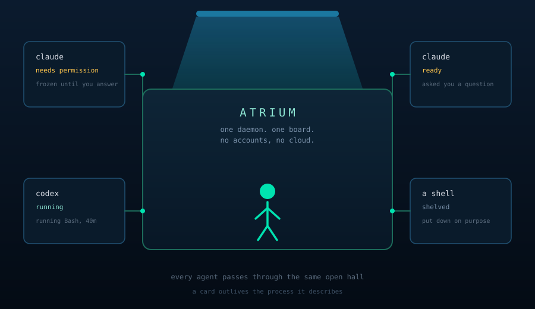

# Atrium

_The single open hall every agent passes through._

> **If you are an agent, read [`docs/agents.md`](docs/agents.md) first.** It says what atrium is today, what runs
> where, how to build and test, and which docs to trust.

<p align="center">
  
</p>

Six coding agents are running. One has been waiting on a yes for twenty minutes. One finished an hour ago and said
nothing. One is about to `rm -rf` something, and one is on your laptop in the other room. You are alt-tabbing
between terminals asking the same four questions: which one needs me, how long has it been waiting, what was I doing
in that one, and is it even alive.

Atrium answers all four on one board. Every agent session is a card. The card that needs you is at the top, says what
it needs, and takes one click to answer. Every tool call an agent makes passes your gate first, and the rules you
already trust answer most of them before you see them. The agents run in real terminals atrium owns, so you can open
any of them in the browser, type into it, or pop it out into its own window. They can talk to each other, across
machines, without typing into a terminal you are using. And it all survives a restart.

It is agnostic about the agent. Claude Code, codex, gemini, opencode, ollama or a plain shell are rows in a runner
table, and adding one is configuration, not code. It runs on your machines, binds loopback, and has no cloud and no
account.

## Why it is called that

A Roman house was built around one open room. Every other room had a door onto it, the roof was open above it so it
was the only part of the house with its own light, and anyone crossing from one room to another crossed it. You stood
in the atrium and saw the whole household at once.

That is the shape of the problem, and three things follow from taking the metaphor seriously:

- **You are in the hall, not in a room.** The board is not a terminal multiplexer. It answers what needs you, and
  gets out of the way when nothing does.
- **A room outlives whoever is in it.** A card is not an agent. It is a place work happens, and it survives the
  process, the restart and the conversation. A pid is a reconnect hint.
- **Rooms do not connect to each other.** One session reaching another goes through the hall, and arrives as a
  message from a peer, never as keystrokes in a terminal a person may be typing in.

The hall is literal now. `atrium run` is the hub that serves the board. Each machine, or each account, runs a room
that holds its agents and dials the hub. One board shows every room.

## Quick start

You need Go at the version `go.mod` names.

```bash
git clone https://github.com/dovholuknf/atrium && cd atrium
go build -o build.claude/ ./cmd/atrium
mkdir -p ~/.atrium/bin && cp build.claude/atrium ~/.atrium/bin/   # atrium.exe on Windows
~/.atrium/bin/atrium run
```

Open <http://localhost:7778>. `atrium run` serves the board and, the first time, makes this machine's room and starts
it in the background. Stopping `atrium run` never stops the room or its agents.

Run it from the installed copy, not from `build.claude/`. Hooks, the logon task and the self-restart all name the
binary's path, and a path under `build.claude/` is rewritten by every build.

Then wire your agents in. On the board, **runners** then **hooks** writes the missing hook entries into Claude Code's
`settings.json` (or run `atrium hook install`). From then on every Claude Code session on this machine reports to the
board, and every tool call it makes asks the gate. **perms** then **import rules from claude** turns the allow and
deny lists you already have into standing rules, so the gate starts out knowing what you trust.

To start an agent under atrium instead, use the board's launch dialog or `atrium launch`.

### Another machine

On the hub's machine, name the room and get its join string:

```bash
atrium rooms add laptop          # prints atr1_..., good once and for an hour
```

On the other machine, with atrium installed the same way:

```bash
atrium room join atr1_...        # the first time
atrium room                      # every time after
```

The room dials the hub over mutual TLS, so the hub's link port (7779) has to be reachable from it, or the two use a
zrok share or OpenZiti instead. Its cards appear on the same board. `docs/fabric/hub-and-rooms.md` has the details.

## What it gives you

**A board.** Every agent is a card in a column: needs permission, ready, running, finished, shelved. The columns are
buckets of your attention, so a card sits in one because you have to act or because you decided something.

**The difference between a question and a finish.** An agent that ran out of work and an agent that asked you
something both stop, and they want very different amounts of hurry. Atrium tells them apart, and the one that asked
sorts first and says what it asked.

**What each one is doing right now.** A live badge per card: thinking, running `Bash`, three subagents, and for how
long. "Running Bash for 40 minutes" is not something a status column can tell you.

**A permission gate.** Every tool call an agent wants to make blocks until it is answered. Approving is one click.
Blocking hands your reason back to the agent, so a refusal is "no, do this instead" rather than a wall. A pending edit
shows a real diff.

**Standing rules, so you stop clicking.** Answer once with **always** or **never** and every matching request after
that is answered instantly. A rule is a command prefix, a glob, or a folder, and the most specific match wins.

**Auto mode, when you do not want to be asked at all.** For one session or the whole board. Everything is still
recorded, and **what did it do?** reads the record back afterwards, grouped by tool, the decisions nobody saw first.
It never overrides a **never** rule or a shelved card.

**Terminals atrium owns.** Anything atrium launches runs in a pseudo terminal it owns: attach in the browser, type,
pop it out into its own window, or stop it. With the `pty_host` setting on, the terminals outlive a room restart.

**Agents that talk to each other.** `atrium_say` reaches another session on the board, `name@room` one on another
machine. A message is typed when the other session's input line is clear, or carried on its next hook, and always
framed as a peer speaking.

**One board over many machines and accounts.** A room per machine, or per operating system account so an agent can
run as its own user, all on one board. A permission request from any of them is answered in your own perms tab.

**Notifications that reach you.** Desktop notifications with approve and block buttons, Web Push to a phone, and a
sound per card, so you know which session wants you without looking.

**A switcher, on a keystroke.** `ctrl-shift-k`, a few letters, Enter. The last few you went to come first.

**Files, both ways.** Drop or paste into a session, or browse its directory and take a file or the whole tree back
out, all inside one containment check against that card's own directory.

**Work that finds you.** Sources on a timer raise cards from issues, tickets or CI. A pasted pull request link opens a
card with its worktree and its review.

**A history.** Every card has an append-only event log, and every permission decision records who asked and who
answered: you, a rule, or auto mode. Every card ever created stays searchable.

**Reachable from elsewhere, without becoming a proxy.** The board can be served on a zrok share or an OpenZiti
service, answered in-process on the overlay's own listener. Atrium never holds an identity or decides who connects.

`FEATURES.md` lists everything, one entry per capability.

## Configuration

| Var | Default | Meaning |
| --- | --- | --- |
| `WORKTREE_ROOT` | unset | When set, atrium keeps its state in `hub/` under it. Unset means `~/.atrium`. |
| `ATRIUM_HUB_URL` | the running room | Where `atrium join` and the hooks post, overriding the room's location file. |
| `ATRIUM_LOCATION` | the machine's location file | The file a room writes its address to and hooks read it from. Set for a second room's sessions. |
| `ATRIUM_PERM_GATE` | unset | `on` gates every session. `off` disables. Unset gates sessions that joined or were launched by atrium. |
| `ATRIUM_AGENT_NAME` | directory name | What a session calls itself. Set automatically for runners atrium launches. |
| `ATRIUM_TASK_ID` | unset | Binds a launched runner to its card. Set automatically. |
| `ATRIUM_ROOM` | unset | The room a launched session is on, so its control calls are scoped there. Set automatically. |

| Port | What | Flag |
| --- | --- | --- |
| 127.0.0.1:7778 | the hub's board | `atrium run --addr` |
| 127.0.0.1:7779 | where rooms dial in. May bind wide, with `--link-advertise` naming the address for join strings | `atrium run --link` |
| 127.0.0.1:7777 | the room's agent listener, where hooks post | `atrium room --agent` |
| 127.0.0.1:7781 | the room's own board, for when the hub is down | `atrium room --http` |

The board always binds loopback and has no login. A wide `--addr` is refused.

## Subcommands

| Command | Purpose |
| --- | --- |
| `atrium run [--no-room]` | The hub, which serves the board, plus this machine's room, started detached when none is running. |
| `atrium room` | Run this machine's room: the database, the terminals and the agents. `--detach` runs it in the background. |
| `atrium room join <string>` | Join a room to a hub, the first time, with the string `atrium rooms add` printed. |
| `atrium rooms add/ls/token/mark/rm/log/legacy/git` | The rooms a hub knows about, managed on the hub's machine. |
| `atrium backups [restore <snapshot>]` | The hub's snapshots of its own store, and putting one back. |
| `atrium daemon` | The older single process: board :7778, agents :7777, no hub. The service installers still default to it. |
| `atrium stop` | Ask a running room to wind down. Not the same as killing it. |
| `atrium launch` | Put a directory on the board and start a runner in it. |
| `atrium open [url]` | Open a link as a card: a pull request gets its worktree, its review and a session. |
| `atrium join` / `leave` | Put the session you are in on the board, or take it off, without a restart. |
| `atrium hook` / `session` / `turn` | The hook entry points. `atrium hook install` writes them into Claude Code's settings. |
| `atrium task` / `exit` / `new-context <who>` | Show a card, ask its runner to leave, or cycle it onto a fresh context. |
| `atrium finish [recap]` | An agent saying its work is over, and what it did. |
| `atrium ask [--continue] [--peer <handle>]` | A session saying it is stuck and what would unstick it. |
| `atrium answer <handle>` | The reply to one of those. |
| `atrium ready` | A session saying its handoff is written, so atrium can clear its context. |
| `atrium peers` / `tell` | The other sessions this one can address, and saying something to one. |
| `atrium backlog` / `reports` | The hub's backlog and director reports, from any room. |
| `atrium resources` | The machines and environments agents may use. |
| `atrium preview` | A throwaway second board, on a copy of your cards, for looking at a change before installing it. |
| `atrium control` | A stdio MCP server for sessions that do not reach the hub: status, restart, the peer tools, git and open. |
| `atrium db compact` / `ledger` / `usage` | Offline tools for a room's database: a packed copy, the work ledger, token use. |
| `atrium name [<name>]` | Name this atrium once, so two machines cannot claim each other's cards. |
| `atrium version` | The build, its commit, and whether the tree was clean. |

Sessions get the same verbs and more as MCP tools from the hub's control server at `/_hub/mcp`: `atrium_peers`,
`atrium_say`, `atrium_launch`, `atrium_report`, `atrium_backlog` and the rest. `website/docs/control-mcp.md` lists
them.

Two room endpoints are worth knowing by hand. `POST /v1/tasks/{id}/model` with `{"model":"sonnet|opus|..."}` switches
a live Claude card's model by typing `/model` into the terminal atrium owns, and records it so a resume keeps it.
`GET /v1/tasks/{id}/changes` answers what a card's worktree has changed, `?against=head` (the default) or
`?against=base`, bounded at 400 files, 256 KB a file and 2 MB in all.

## Scope

This is a personal tool. The parts that are missing are missing on purpose.

- **No accounts, no login, no cloud.** The board binds loopback. Reaching it from elsewhere is an overlay's job, and
  rooms on other machines reach the hub over mutual TLS with a certificate the hub signed.
- **Atrium never becomes an overlay.** It starts a share and serves on it. Holding an identity, proxying traffic or
  deciding who may connect are on the other side of a line it does not cross.
- **No prompt injection from outside.** A message to a session arrives as a peer speaking, typed only when the line is
  clear or carried by a hook.
- **The board is a plain page.** It speaks the same JSON and SSE API anything else could.
- **Windows first.** It builds and the tests pass on Linux and macOS, and the scripts shipped alongside it are mostly
  PowerShell.

## Documentation

- The manual: `website/docs/`, published at <https://dovholuknf.github.io/atrium/>.
- `docs/how-atrium-works.md`: the whole system on one page.
- `docs/fabric/hub-and-rooms.md`: the hub, rooms, joining and ports.
- `docs/agents.md`: the bring-up for an agent working on atrium.
- `docs/README.md`: the map of everything else in `docs/`.
- `FEATURES.md`: every capability, one entry each.
- `docs/room-accounts.md`: why a room should not run as an administrator or as you, and how to set up an account.
- `changelog/`: what landed, one file per change. `CHANGELOG.md` holds everything before 2026-09-29.

## License

Apache 2.0. See `LICENSE`.
