# u-001 phase 1: every screen on a phone, audited by touch

Status: phase 1 done (find and rank). No board code was changed. Asked for by clint, run by @ui. Phase 2 is the
waves at the end of this doc.

## How this was measured

`scripts/audit-phone-u001.js` serves the concatenated board (`board-source.js`) and `/m` off disk. It mocks every
endpoint with seven cards across every status, two permissions (one an Edit with a diff), runners, fixtures,
sources, providers, recognisers, actions, history, usage and a two-room hub. A fake attach socket paints a claude
screen with a permission dialog. It drives each screen in a Chromium context with `isMobile` and `hasTouch` at
**390x844** and **412x915**, taps every control it opens, and runs four probes in the page:

- **targets**: every visible interactive element on top at its centre, flagged under 44px on either side (inline
  links in running text exempt, as WCAG 2.5.8 exempts them)
- **fit**: sideways scroll, anything past an edge, clipped text, text under 11px, open dialogs taller than the screen
- **the soft keyboard**: the field is tapped, the viewport cut by 40% (what `interactive-widget=resizes-content`
  does on Android), the field scrolled into view, and the primary action measured
- **hover-only**: every `:hover` rule that reveals something, checked against the resting page

The raw numbers are in `img/u-001/report.json`, keyed by screen then width. The full set of screenshots (around 80
screens at both widths) stays out of the repo. Re-run it with:

```
NODE_PATH=<dir with playwright> node scripts/audit-phone-u001.js build.claude/u001-report.json
```

Shots land in `build.claude/u001-shots/` as JPEG. `U001_ONLY=card-menu,terminal` and `U001_WIDTH=390` re-drive one
step. 412 reads the same as 390 on every screen except where a number is given, so the cited shots are at 390.

**What is fine everywhere.** No screen scrolls sideways at either width, nothing sits past the right edge, and no
page threw. The card menu fits the screen (619px tall, bottom at 836 of 844). The launch dialog, runner edit, the
reason dialog and settings all keep their field and their action on screen with the keyboard up.

## The remote path first: approving and answering without a keyboard

The case clint cares about most: the board reached over an overlay from a phone, answering a permission or a
question with a thumb.

### R1. A tap on `? N` throws the questions away unread

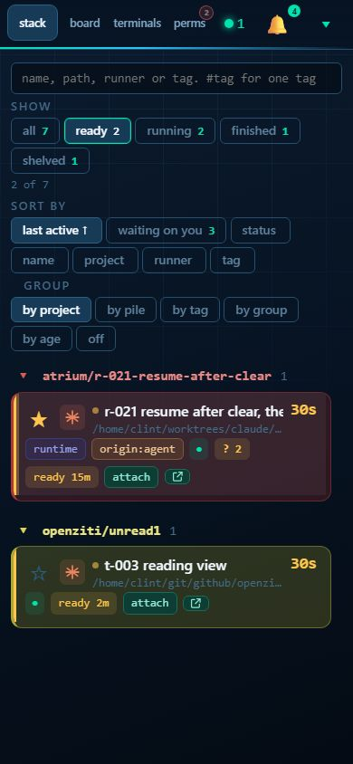

The `? 2` chip on a card is the only place on the board that says a card asked something. The questions themselves
live in its tooltip (`data-tip`), which a phone never shows. And its click handler is `dismissQuestionsChip`
(`js/seen.js:46`), so **one tap posts `/questions/dismiss`** and the chip is gone, measured at both widths. On a
phone the natural gesture ("what is it asking?") erases the question. The target is also 39x24.

Fix: on `pointer: coarse` a tap opens the questions in a small sheet, with "attach", "say" (the card's message path)
and "dismiss" as three 44px buttons. Desktop keeps click to dismiss. Region **seen.js chip handler** plus a sheet
style of its own. **S to M.** Failing check: `u001Audit` R1.

### R2. Editing a permission's command hides approve under the keyboard

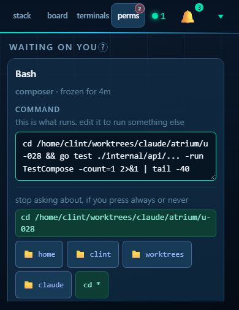

`.row.perm` puts the command box above the answer (right, per `phone.css` 480px block). But with the keyboard up
the command is at 215..295 and `approve once` at 628..672 in a 506px viewport: after editing what will run, there
is no way to approve it without dismissing the keyboard and scrolling. Measured again in the headless check with
the field scrolled into view: approve at 476..520 of 506.

Fix: while a command box in a `.row.perm` has focus on a phone, pin the row's four answers in a bar at the bottom
of the visual viewport (the same `--vvh` the terminal already uses). Region **`.row.perm` in rows.css, the phone.css
480px block, `permCard` in stack.js**. **M.** Failing check: `u001Audit` R2.

### R3. The permission strip over a terminal has 36px buttons

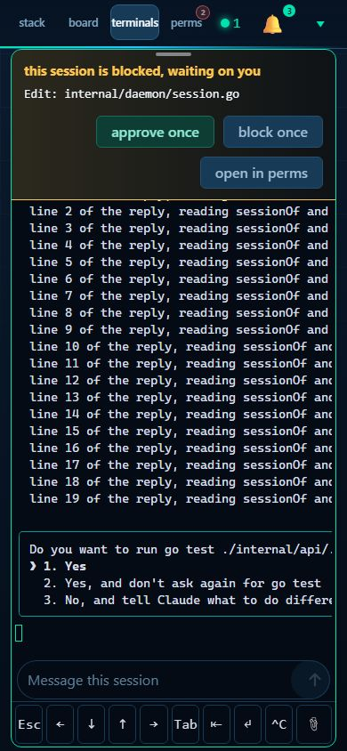

`#term-perm` is the one place a phone answers without leaving the session, in the board and in the pop-out. Its
`approve once`, `block once` and `open in perms` are 132x36, 112x36, 138x36. The strip itself fits (56..225).
`block once` opens the reason dialog, which fits with the keyboard up (field 106..150, send 195..228). Region
**`.term-perm` in terminal.css** (not the key bar, not the composer). **S.** One-line candidate below.

### R4. The card menu's flyouts close on their own after a tap

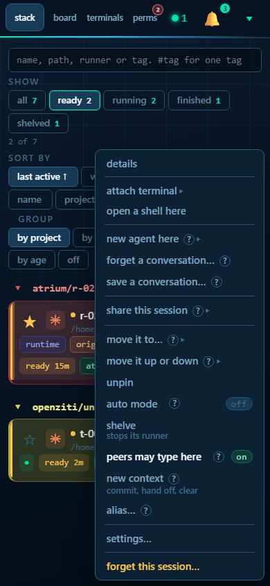

A tap on a stack row opens the card menu (17 rows, 29 to 45px tall). Five rows are flyouts: attach terminal, new
agent here, share this session, move it to, move it up or down. `wireFlyouts` (`js/sharing.js:671`) opens a flyout
on `pointerenter` and closes it 650ms after `pointerleave`. A touch fires both, so the flyout **opens and then
closes itself**: measured open at 150ms, closed at 900ms, menu still up. On a phone, attach terminal and new agent
here cannot be picked from the menu. The `?` help bubbles in the rows are tooltips too.

Fix: on `pointer: coarse` a tap toggles `subopen` and nothing closes it but another tap or closing the menu, and the
flyout opens below its row rather than beside it (there is no room beside it at 390). Rows to 44px. Region
**`wireFlyouts` and `showMenu` in sharing.js, `#cardmenu` in cards.css**. **M.** Waits on u-031: `termMenu`
(`js/terminal-list.js:656`) draws through the same `showMenu` and flyout wiring.

### R5. The perms page's folds and tools are under a thumb

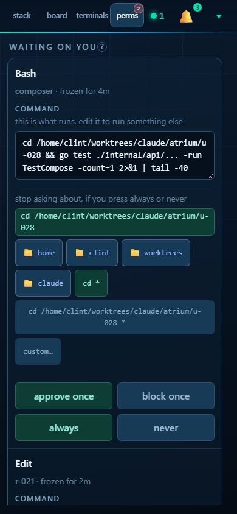

On the perms page: `what changes` (the diff fold) is 26px tall, `standing rules` and `decisions` 28px, `allow a
folder` and `import rules from claude` 37px, `export` and `import file` 36px. The answers themselves are already 44px
(the 480px block). Region **`details > summary` in dialogs.css** (shared by every fold on the board) and the
rules toolbar. **S.**

### R6. The terminal's tray is 29px buttons

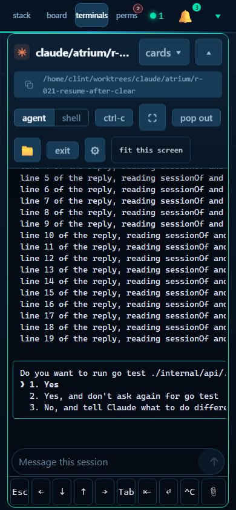

The tray (u-023) is the terminal's only chrome on a phone. Its row keeps the desktop bar's controls at desktop size:
agent 67x29, shell 59x29, ctrl-c 63x29, pop out 82x29, exit 53x29, the copy button 40x26. The tray's own chevron,
picker and full screen are already 44px. Region **`body.term-phone .term-bar` in phone.css**, minus `#t-keys` and
`#t-compose`. **S.** Sits beside u-029 and u-031, so it waits for them.

### R7. The header tabs are 40px everywhere

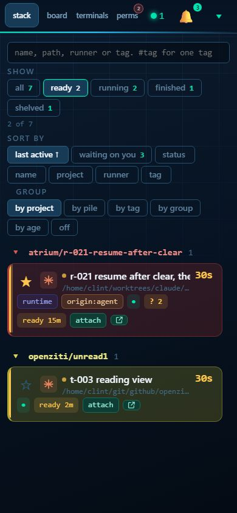

Every board screen: the four slim-row tabs are 56x40 (44x40 when a fifth is showing), the bell 50x40. The count
badges are 9px text. Region **the u-026 block in phone.css**. **S.**

### R8. `/m` is the answer for the remote path, and it measures like one

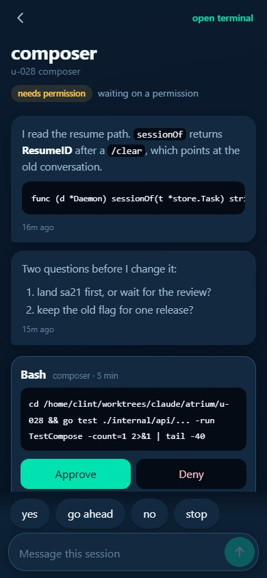

`/m` home and all have no target under 44px. The card has one, the composer's textarea at 292x40, which grows as
you type. Deny with a reason opens a textarea whose send button stays on screen with the keyboard up (field
313..380, deny 388..432 of 506). The composer keeps its send button beside the field with the keyboard up
(`img/u-001/m-compose-kb-390.jpg`). The only clipping is long names and reasons, cut with an ellipsis on the row.
Nothing to fix here in phase 2. The board's R1 to R4 matter because a notification or a habit still lands on the
board.

## Everything else, by screen

| # | Screen | What does not fit or work by touch | Region | Size |
| --- | --- | --- | --- | --- |
| E1 | stack, board, perms rules and decisions | Every `.seg` pill (show, sort by, group, by project and so on) is 28 to 29px tall. It is 35 to 45 of the small targets on these screens, most of the board's total. The pills also wrap onto two and three rows, which is the "40% before the first card" in mobile-design. | `.seg button` in dialogs.css | S |
| E2 | card detail dialog | The pin star 30x25, tag chips 24px tall, `attach` 60x24, the pop-out chip 29x17, the `files` toggle 47x15. The dialog is 738px tall, inside the screen. | detail dialog rules in dialogs.css and cards.css `.chip` | M |
| E3 | launch, settings, runner edit, browse | `close` is 62x31 on every dialog head. The checkboxes measure 13 to 16px but each sits in a `label.check`, so the row is the target and those are a false positive. | `.dlg-head > button` in dialogs.css | S |
| E4 | runners page, all 8 panes | Row buttons (edit, duplicate, hooks, start) are 25px tall, the earlier and later arrows 39x25. They rest at `opacity: .55` and lift on `.row.line:hover`, which a phone never has, so they read disabled. | `.row.line button` in rows.css | S |
| E5 | history, usage, audit | Selects are 19px tall: `#h-recap`, `#uc-group`, `#audit-room`, `#audit-kind`. | `select` in dialogs.css or chrome.css | S |
| E6 | toast log | The dialog takes the whole 844px height and the probe flags its box as past the screen's edge. The copy buttons are 18x18. | `#toastlog` in notify.css | S |
| E7 | switcher | 10 labels clipped. The name clips at the END (`github/openziti/perm1` shows as `github/openziti/pe…`), which is the part that tells two cards apart. | switcher rules (`.swname`, `.swdir`) | S |
| E8 | rooms menu, rooms dashboard | The room cog 24x24, `2 needs you` 19px tall, the disconnected room's `x` rests at `opacity: 0` and shows only on hover (`chrome.css:177`), so forgetting a room is unreachable by touch. | rooms-dash region in chrome.css | S |
| E9 | terminals list, the tray's card picker | The pinned group head is 14px tall, the pin star 13x16, the `? 2` chip 39x24. | `.tgroup`, `.pin` in sharing.css, phone.css 520px block | S to M |
| E10 | terminal files panel | A file's `edit here`, `open there` and `get` show on `:hover` or `:focus-within` only (`files.css:70`). A tap on the name does reveal them, through the browser's sticky hover, but nothing says they are there. | `.filelist .facts` in files.css | S |

Screenshots: E1 `board-390`, E2 `detail-390`, E3 `launch-390`, E4 `runners-fixtures-390`, E5 `audit-390`,
E6 `toastlog-390`, E7 `switcher-390`, E8 `rooms-dash-390`, E9 `terms-390`, E10 `terminal-files-tapped-390`, all under
`img/u-001/` as `.jpg`.

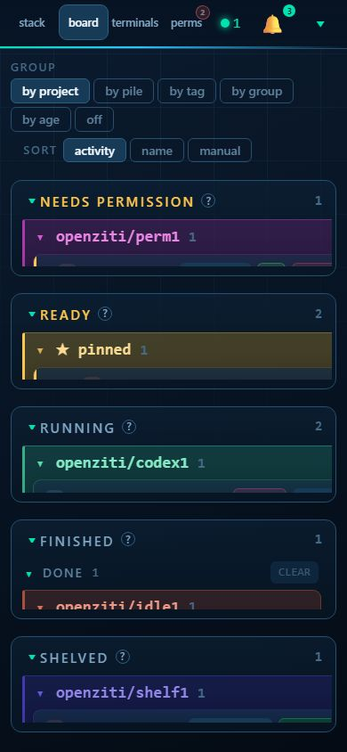
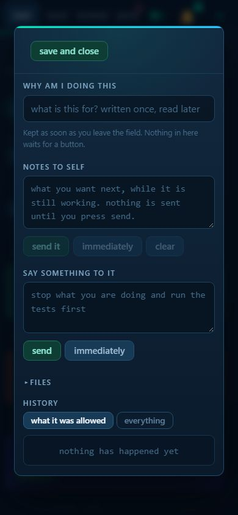
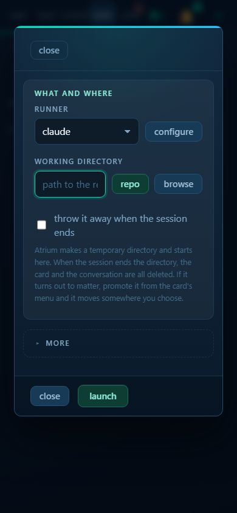
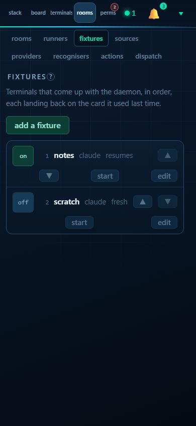
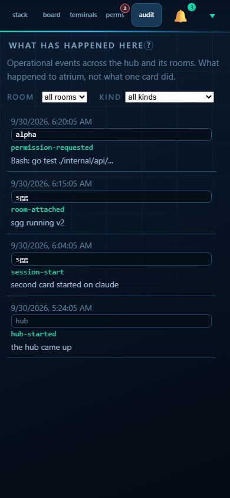
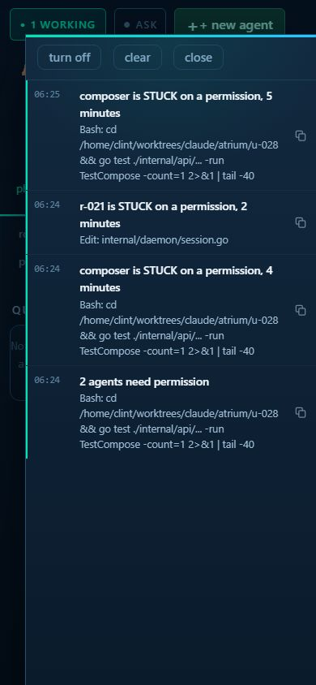
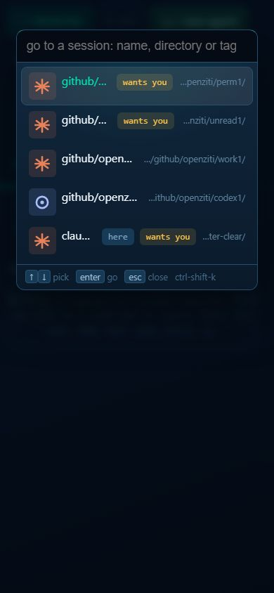
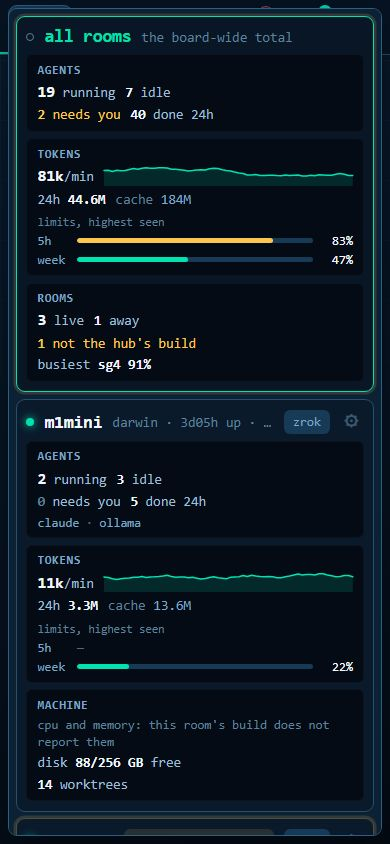
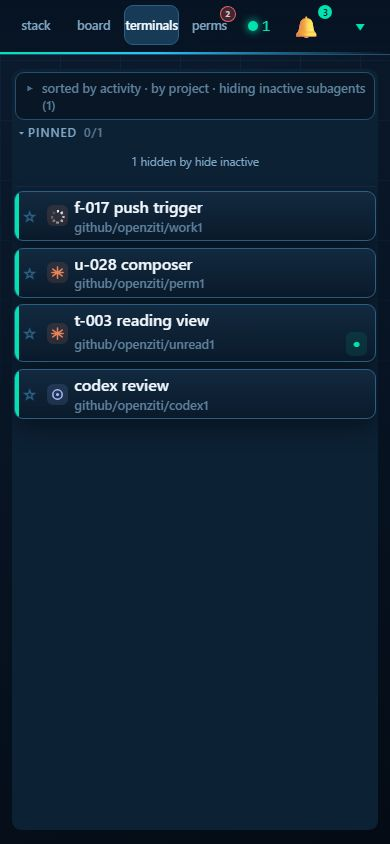
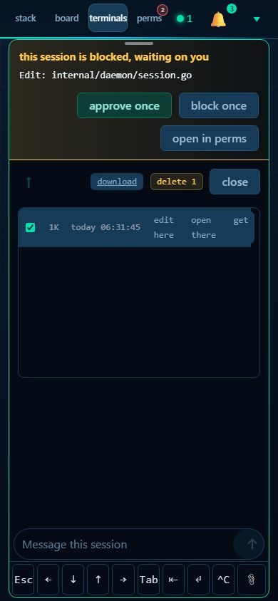

**Screens driven and clean enough to leave alone.** Settings (all eight panes, the keyboard up on a number field
keeps the field and close on screen), the launch dialog (the keyboard up on the directory and on the first
instruction keeps `start` on screen at 429..466 of 506), runner edit, the browse picker, history search, usage,
audit, the pop-out, full screen, the terminal cog, the composer (u-028's, measured only).

**The hover-only probe** found nothing live on any phone screen or on a desktop board at rest, because the hover
reveals sit on things that were not open at that moment. Read by hand instead, the ones a phone cannot reach are E8
and E10, and the dimmed resting state is E4. Everything else it lists only brightens a control that is already
visible.

## Groups by file region, with sizes

Each group is one region nobody else edits, so each can go to one worker.

| Group | Findings | Files and rules | Size |
| --- | --- | --- | --- |
| G1 remote answers | R1, R2, R3 | `js/seen.js` chip handler and a new questions sheet, `.row.perm` in rows.css with the phone.css 480px block and `permCard` in stack.js, `.term-perm` in terminal.css | M (about a day) |
| G2 menus on touch | R4 | `wireFlyouts` and `showMenu` in sharing.js, `#cardmenu` in cards.css | M |
| G3 thumb-size chrome | R5, R7, E1, E3, E5 | one `(pointer: coarse)` block of its own in phone.css covering `.seg button`, `details > summary`, `.dlg-head > button`, `select`, and the header tabs in the u-026 block | S |
| G4 the terminal's tray | R6, E9 | `body.term-phone .term-bar` in phone.css (not `#t-keys`, not `#t-compose`), `.tgroup` and `.pin` in sharing.css | S |
| G5 rows and dialogs | E2, E4, E6, E7, E8, E10 | the detail dialog, `.row.line button` in rows.css, `#toastlog` in notify.css, the switcher, rooms-dash in chrome.css, `.filelist .facts` in files.css | M |

## One-line fixes that are plainly safe (listed, not made)

Each sits outside every region named in the brief (u-028, u-029, u-030, u-031):

- `terminal.css`, after `.term-perm`: `@media (pointer: coarse) { .term-perm button { min-height: 44px; } }` (R3).
- `dialogs.css`: `@media (pointer: coarse) { details > summary.col-head, details.change > summary { min-height: 44px; } }` (R5).
- `dialogs.css`: `@media (pointer: coarse) { .dlg-head > button:not(.go):not(.no) { min-height: 44px; } }` (E3).
- `rows.css`: `@media (hover: none) { .row.line button { opacity: 1; } }` (E4, the dimmed look only, not the size).
- `chrome.css`: `@media (hover: none) { .rooms-menu button .roomx { opacity: .7; } }` (E8, the hidden `x`).

The `.seg button` one (E1) is one line too, but it is not plainly safe: 44px pills make the filter rows that already
take about 40% of the stack's first screen taller still. It belongs with the collapse of those rows, in G3.

## Headless checks that fail today

`u001Audit` in `scripts/test-board-headless.js`, NOT in the default run, so nothing goes red on the branch:

```
HEADLESS_ONLY=u001Audit NODE_PATH=<dir with playwright> node scripts/test-board-headless.js
```

It fails three ways today, and each goes green when its group lands:

- **R1**: a touch tap on the stack's `? N` chip at 390x844 must not post `/questions/dismiss`.
- **E1**: the stack's `.seg` pills must be at least 44px tall on a phone. They are 28.
- **R2**: with the keyboard up on a permission's command box, approve must be on screen. It is at 476..520 of 506.

## Proposed waves

**Wave A, now, in parallel (touches none of u-028 to u-031):**

- **G1 remote answers**, one worker, first in line: it is the remote path. Needs no new event: the questions are
  already on the card (`seen.open_questions`), the permission rows are already live.
- **G3 thumb-size chrome**, one worker. Its phone.css rules go in a block of their own, apart from the u-026 and
  u-023 blocks, as the brief asks. Includes collapsing the stack's three filter rows to one line on a phone, since
  44px pills make them worse otherwise.
- **G5 rows and dialogs**, one worker.

**Wave B, after the workers running now land:**

- **G2 menus on touch**, after **u-031**. `termMenu` and the Shift+right click menu go through the same `showMenu`
  and `wireFlyouts`, so two workers there at once collide.
- **G4 the terminal's tray**, after **u-029** (the key bar and `phoneTapKeys`, in the same phone.css blocks) and
  **u-031** (the terminal's menu opens from the same tray). u-028's composer sits between the tray and the keys, so
  G4 re-measures after it lands but does not have to wait on it.

u-030 (the settings gear's notifications row and presence) touches no group. Settings measured clean apart from
the dialog close (G3), which is the dialog head, not u-030's row.

## Open questions

1. R1: should a phone tap on `? N` open a sheet on the board, or go straight to that card on `/m`, which already shows
   the questions with a composer under them? The sheet keeps the board whole. The `/m` jump is cheaper and is
   the page built for it.
2. R2: pinning the four answers at the bottom while editing duplicates them on screen for a moment. The other choice
   is a `done` button on the command box that closes the keyboard. The pinned bar is recommended because it keeps
   the answer one tap away.
3. G3: the stack's filter rows collapsing to one line on a phone ("ready · 2 · by age ▾" opening a sheet) is the
   mobile-design Proposal C header. Is that in G3's scope, or its own item?
